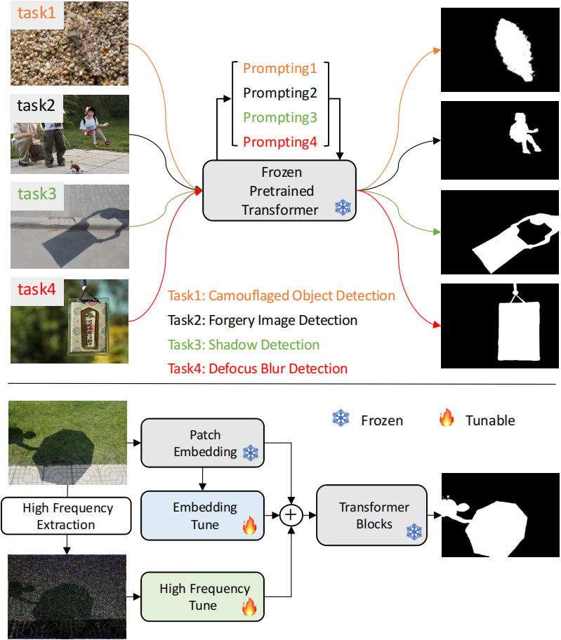

# Explict Visual Prompt

This repository contains the official implementation for EVP introduced in the following paper:

**Explicit Visual Prompting for Low-Level Structure Segmentations**
<br>
Weihuang Liu, [Xi Shen](https://xishen0220.github.io/), [Chi-Man Pun](https://www.cis.um.edu.mo/~cmpun/), [Xiaodong Cun](https://vinthony.github.io/)
<br>
CVPR 2023

<p align="center">
  
</p>

## Environment
This code was implemented with Python 3.6 and PyTorch 1.8.1. You can install all the requirements via:
```bash
pip install -r requirements.txt
```

## Train
```bash
python train.py --config [CONFIG_PATH]
```
## Test
```bash
python test.py --config [CONFIG_PATH] --model [MODEL_PATH] --prompt [PROMPT_PATH]
```
## Demo
```bash
python demo.py --input [INPUT_PATH] --model [MODEL_PATH] --prompt [PROMPT_PATH] --resolution [HEIGHT],[WIDTH] --config [CONFIG_PATH]
```

## Quick Start
1. Download the dataset and put it in ./load.
2. Download the pre-trained SegFormer backbone.
3. Training:
```bash
python train.py --config configs/train/segformer/train_segformer_evp_defocus.yaml 
```
4. Evaluation:
```bash
python test.py --config configs/test/test_defocus.yaml  --model mit_b4.pth --prompt ./save/_train_segformer_evp_defocus/prompt_epoch_last.pth
```
5. Visualization:
```bash
python demo.py --input defocus.png --model ./mit_b4.pth --prompt ./save/_train_segformer_evp_defocus/prompt_epoch_last.pth --resolution 320,320 --config configs/demo.yaml
```

## Models

Please find the pre-trained models [here](https://uofmacau-my.sharepoint.com/:f:/g/personal/mc05379_umac_mo/EneRfHlTuPZCjH-VVBZVQpMBFXqqdRdU6l8a31jo3i5GOA?e=zagGg1).


## Dataset

### Camouflaged Object Detection
- **COD10K**: https://github.com/DengPingFan/SINet/
- **CAMO**: https://drive.google.com/open?id=1h-OqZdwkuPhBvGcVAwmh0f1NGqlH_4B6
- **CHAMELEON**: https://www.polsl.pl/rau6/datasets/

### Defocus Blur Detection
- **DUT**: http://ice.dlut.edu.cn/ZhaoWenda/BTBCRLNet.html
- **CUHK**: http://www.cse.cuhk.edu.hk/leojia/projects/dblurdetect/

### Forgery Detection
- **CAISA**: https://github.com/namtpham/casia2groundtruth
- **IMD2020**: http://staff.utia.cas.cz/novozada/db/

### Shadow Detection
- **ISTD**: https://github.com/DeepInsight-PCALab/ST-CGAN
- **SBU**: https://www3.cs.stonybrook.edu/~cvl/projects/shadow_noisy_label/index.html


## Citation

If you find our work useful in your research, please consider citing:

```
@article{zhang2022sadtalker,
  title={SadTalker: Learning Realistic 3D Motion Coefficients for Stylized Audio-Driven Single Image Talking Face Animation},
  author={Zhang, Wenxuan and Cun, Xiaodong and Wang, Xuan and Zhang, Yong and Shen, Xi and Guo, Yu and Shan, Ying and Wang, Fei},
  journal={arXiv preprint arXiv:2211.12194},
  year={2022}
}
```